<a href="https://kanenil.com">
  <picture>
    <source media="(prefers-color-scheme: dark)" srcset="assets/banner-dark.svg">
    
  </picture>
</a>

  <a href="https://kanenil.com"><picture><source media="(prefers-color-scheme: dark)" srcset="assets/link-website-dark.svg"></picture></a>
  <a href="https://kanenil.com/cv/oleksandr-burda-cv.pdf"><picture><source media="(prefers-color-scheme: dark)" srcset="assets/link-cv-dark.svg"></picture></a>
  <a href="https://www.linkedin.com/in/oleksandrburda/"><picture><source media="(prefers-color-scheme: dark)" srcset="assets/link-linkedin-dark.svg"></picture></a>
  <a href="mailto:oleksandrburda2004@gmail.com"><picture><source media="(prefers-color-scheme: dark)" srcset="assets/link-email-dark.svg"></picture></a>
  <a href="https://t.me/oleksandrburdaa"><picture><source media="(prefers-color-scheme: dark)" srcset="assets/link-telegram-dark.svg"></picture></a>

## Hi, I'm Oleksandr 👋

I'm a full-stack developer from Ukraine, based in Dortmund. I design architectures, build APIs and craft interfaces with **Next.js, React, TypeScript and Node.js**, then own them through deployment and production.

- 💼 **Full Stack Developer at MagneticOne** (remote, since May 2024): full-stack features across 3 production SaaS products
- 🏗️ Application architecture from scratch: PostgreSQL and NoSQL data models, REST and GraphQL APIs, third-party integrations
- ☁️ Event-driven workflows with AWS (S3, Lambda, SQS) and Cloudflare Queues, Docker and CI/CD for a monorepo
- 🧪 Automated tests with Jest, Vitest, Playwright and Cypress, production monitoring with Sentry
- 🌍 English (B2) · German (B1) · Ukrainian (native) · Russian (fluent)

## Tech stack

<picture>
  <source media="(prefers-color-scheme: dark)" srcset="assets/stack-dark.svg">
  
</picture>

## Featured projects

<table>
<tr>
<td width="50%" valign="top">

### [Realtime Chat](https://github.com/Kanenil/realtime-chat)

Direct messages with attachments, emoji reactions, voice channels and live presence. A tRPC API streams updates over WebSockets and publishes them through Redis.

`React` `Vite` `tRPC` `Node.js` `Redis` `Prisma` `MongoDB`

</td>
<td width="50%" valign="top">

### Web Chat

Real-time group chat with file attachments, Google or email sign-in and a saved light / dark theme. Angular client, layered ASP.NET Core API, SignalR events.

`Angular` `TypeScript` `Tailwind CSS` `.NET`

[Frontend](https://github.com/Kanenil/ChatWeb-Frontend) · [Backend](https://github.com/Kanenil/ChatWeb-Backend)

</td>
</tr>
</table>

## Most used languages

  <picture>
    <source media="(prefers-color-scheme: dark)" srcset="https://github-readme-stats.vercel.app/api/top-langs?username=Kanenil&layout=compact&langs_count=6&card_width=420&hide_title=true&hide_border=true&bg_color=0d1117&text_color=a6b4d9">
    
  </picture>

